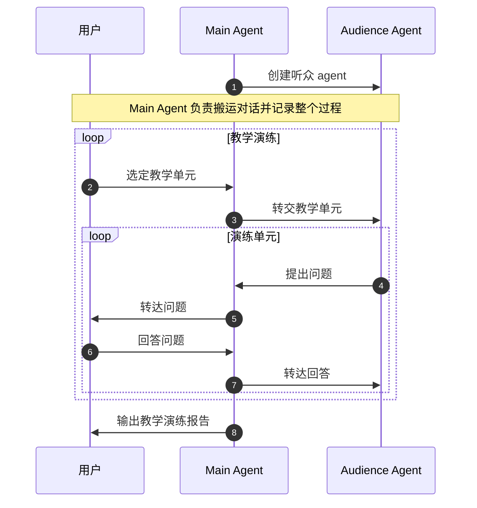

# coach-feynman

借助 AI agent 的能力对费曼学习法中的整个过程进行管理，特别是可以模拟那个原本缺少的听众角色。

## 工作流

以下就是写给作为人类的费曼学习法Skill文档。把[coach-feynman](https://github.com/YMoose/my-claude-sidekick/tree/main/coach-feynman)装载到你的 agent(Claude/Codex/Openclaw) 上的同时，把这个skill装载到你的实践中。

``` markdown
- [ ] step1: 设立学习目标
- [ ] step2: 收集原始学习资料并学习
- [ ] step3: 整理讲述材料
- [ ] step4: 教学演练
```

### step1: 设立学习目标

- skill: `manage-goal`。这个 skill 会帮助设立并管理学习目标。
- 产出物：一份学习计划文件，用来集中记录目标定义、当前水平、学习习惯、单位学习容量以及阶段性学习任务。学习计划并不是固定的，可以根据学习情况持续更新。

#### 1.1. 设定原始学习目标

怎么做：
先提出一个学习目标，这个目标可能很宏大，也可能很具体， 和 agent 讨论，让它了解你想学的到底是什么，你最终想达到什么状态，并帮助你把这个目标澄清成一个相对清晰的目标定义。

为什么这么做：
通常，我们一开始对于未知领域提出的目标是模糊的，存在目标过大、过泛的问题。先和对这个领域有一定了解的人（或者agent）把目标讨论得相对清楚，后面才有办法判断当前差距，并基于此安排学习任务和控制学习范围。

这部分关于目标的讨论也无需太过具体深入，以我的个人经验来看，从你想学习的目的出发，以达成这个目的为基本目标既可。因为一方面你本就对这个领域不了解，讨论过多，可能导致你发现学习任务过重而放弃；另一方面，过早讨论清楚意义不大，目标可能会随着学习的进展而发生改变。

产出物：
学习计划文件中的“目标定义”部分。

#### 1.2. 描述当前水平

怎么做：
从多个角度和 agent 讨论你当前的基础，这部分讨论也不必太过深入、太过细节，agent 会帮助你基本区分哪些内容你已经掌握，哪些只是模糊了解或根本不懂，从而形成一个对你当前水平的基本描述即可。

为什么这么做：
如果没有对当前水平的判断，就无法估计你和目标之间的距离，也无法判断应该从哪里开始推进。后续的资料收集和学习安排，也会因此失去针对性。同时太过深入的讨论会浪费时间，在后续学习过程中可以慢慢补充细节。

产出物：
学习计划文件中的“当前水平”部分。

#### 1.3. 描述学习习惯与单位学习容量

怎么做：
让 agent 进一步了解你的学习习惯，包括你可投入的时间、偏好的学习方式、注意力特点等，并和你一起估计你的单位学习容量。

为什么这么做：
这一步的目的，是希望把单次学习任务控制在一个既能推进、又不过载的范围内，避免因为任务长期超出承受能力，而不断积累挫败感，最后越来越觉得自己学不会，越来越不想学的情况。学习中应该要能够获得正向激励反馈，学习热情才有可能不断持续。

这里的单位学习容量，指的是你大致能够完成一次整个费曼学习法（即本文中 step1 -> step2 -> step3 -> step4 闭环的容量。这个容量可以用学习时间、学习资料的体量或待解决的问题数量等不同方式不同维度组合描述。尤其要注意在预估时，不只是考虑查阅学习资料的精力，还要预留 step3 和 step4 中整理讲述框架、模拟教学与问答的精力消耗，否则整个学习任务会在执行中逐渐失控。

这一步也是在讨论中让你了解自己的过程，了解你的真实学习节奏和精力承受能力或者说注意力的利用能力。在此基础上，你就可以进一步通过[[刻意练习]]的方法来提升你的注意力和学习效率。另一方面你也要意识到，这里单位学习容量并非一成不变的，它会根据你的心情，身体状态和学习内容动态变化。因此不用太死板，根据当时的情况灵活调整学习容量。

产出物：
学习计划文件中的“学习习惯”与“单位学习容量”部分。

#### 1.4. 拆分阶段性学习任务

怎么做：
agent 会综合前面几步的结果，把清晰的目标定义作为终点，把你当前水平的描述作为起点，再结合你的单位学习容量，将这之间的距离拆分成一个相对合理的阶段性学习任务单，并标出学习里程碑。

为什么这么做：
总目标很可能无法在一个单位学习容量中完成，拆分成若干可以逐步推进的小阶段更为合适。这样后续的资料收集、学习和模拟教学才会有明确边界，也更容易获得反馈，得以调整、回退和迭代。

产出物：
学习计划文件中的“阶段性学习任务单”部分，其中包含若干学习里程碑。

### step2: 收集原始学习资料并学习

- skill：无。这一步无需特别的 skill，直接沿用当前的 agent 会话继续即可。

- 产出物：
  - 一份当前阶段的学习资料清单和你自己整理的学习记录
  - 一份“好了，我要开始装X了”的信心

怎么做：
围绕当前阶段的学习目标收集学习资料，优先使用你自己获取的资料，必要时再要求 agent 协助你补充关键缺口，而不是无限扩展资料范围。

阅读学习这些资料。在学习过程中，尽量用自己的话进行记录和整理，重点包括：核心概念、关键关系、前置知识、重要例子以及尚未解决的问题（你自己经过思考提出的）。对于其中不懂、不确定或难以理解的部分，可以向 agent 请求协助帮你核对理解、定位依据，并在必要时用**类比**的方式帮助你建立直观认识。

这一步的目标是要在你脑中先形成一个初步的理解框架，并逐步暴露并填补理解中的缺口。

为什么这么做：
这一步的重点，不是把当前阶段彻底学透，而是先建立足以支撑下一步起草讲述材料的理解基础。

如果过早追求“完全掌握”，很容易陷入资料堆积、过度学习和迟迟不进入输出阶段；但如果理解还过于零散、模糊，后面的讲述材料也会变成机械拼接。

通过“收集资料 -> 学习理解 -> 提出问题 -> 请求核对和澄清”这个过程，你可以逐步形成自己的理解结构，并尽早发现知识缺口、概念误解和解释上的薄弱点。

当你感觉能够用自己的话大致说明当前阶段的核心内容，就可以进入下一步。
并不一定要强迫自己学习到某种完美程度。如果你已经开始对资料产生明显抵触，往往说明当前阶段的范围、节奏或资料量需要调整。可以使用`manage-goal` 记录并调整自己的学习节奏和计划。这时候休息放松一下吧~

另外，类比可以提升学习效率，背后有多科学实验论证。从大脑运作的生物原理看，它能激活核心思考脑区，串联已有记忆脉络，既减轻脑力负担，又让记忆更扎实；从认知规律来讲，类比把晦涩陌生的抽象知识和你熟悉的日常经验衔接，帮助你快速吃透本质；认知语言学印证其契合语言底层思维，就连人工智能的发展也反向验证了类比是跨领域通用的高效知识迁移法则。

### step3: 整理讲述材料

- skill: `draft-outline`。 这个 skill 不会继续补资料，而是会协助你把 step2 中形成的理解先重新组织成一个适合对外讲述的讲述框架，并在此基础上逐步发展成更具体的讲述材料。
- 产出物：一份讲述材料（格式不限但推荐markdown文档格式）。

#### 3.1 搭建讲述框架

怎么做：
基于 step2 中的学习记录先整理出一个初步的讲述框架。先确定主线和顺序，不要急着追求完整表达。

优先想清楚：

- 这次讲述最核心的问题或主题是什么
- 应该先讲什么，后讲什么
- 哪些概念必须先解释
- 哪些地方需要补上逻辑连接

为什么这么做：
学习记录是给自己看的，讲述框架是给别人听的，这两者并不一样。你在 step2 中得到的是“我大概理解了”，而这一步要做的是把这种理解重新组织成一个别人能够跟上的讲述框架。

如果讲述框架没有先立起来，后面补再多材料，也只是把内容越堆越散。

产出物：
一份初步的讲述框架。

#### 3.2 完善讲述材料

怎么做：
在讲述框架上，进一步补足让别人真正听懂的具体内容，形成一个相对完整的讲述材料。这里的重点是补上那些真正要讲述给别人的部分，不是把所有学到的内容都塞进去。

这里你需要着重思考并安排（包括但不限于）这些内容：

- 哪些例子最能帮助理解
- 哪些类比能帮助建立直观认识
- 哪些前提或定义还需要补充
- 哪些地方听众最可能听不懂或跟不上
- 哪些内容虽然你学到了，但在当前讲述中可以先不讲

在有了基础版本后，可以和 agent 讨论并进一步丰富完善：补足遗漏的前提、调整讲述顺序、增加必要的例子或类比、修正不顺的逻辑连接。

为什么这么做：
只有讲述框架还不够，一个真正能拿来讲的材料还需要“血肉”。很多时候你以为自己讲得清楚，其实只是因为脑子里默认了太多前提，存在“知识的诅咒”。

这一步的作用是尽可能地把“自己懂”和“别人能听懂”之间的差距补上。

产出物：
一份可用于讲解的讲述材料初稿（格式不限但推荐markdown文档格式）。

#### 3.3 简化讲述材料

怎么做：
在上一步的基础上，再做一次有意识的简化。删掉会分散注意力的部分、重复内容、过早出现的复杂术语以及对当前讲述目标帮助不大的细枝末节。

同时检查：

- 讲述的逻辑主线是否清楚
- 每一部分是否都在为主线服务
- 是否存在明明可以一句话说清，却讲得过长的地方
- 是否存在你自己觉得“讲起来有点拧巴”的地方

为什么这么做：
如果没有这一步，直接进入教学，往往会出现两个问题：

- 自己脑子里觉得懂了，但一讲出来顺序就乱。整理讲述逻辑的过程，本身也是在帮你重新梳理自己的知识结构。
- 内容堆得很多，但听众抓不住主线。帮听众提炼主线的同时，你也会更清楚这部分内容的主次关系。

先丰富，再简化，是为了避免一开始就讲得太干，也避免后面越补越乱。最终目标不是“内容看起来很多”，而是“别人能听懂，且你自己讲得顺”。

产出物：
一份更适合实际讲解的讲述材料（格式不限但推荐markdown文档格式）。

### step4: 教学演练

这是费曼学习法中最重要最核心的一部分。先引入几个术语：

- 教学单元：讲述材料中边界清晰的一小块内容，例如一页 PPT、一小节、一个核心问题、一个概念模块或一个关键例子。
- 演练单元：围绕一个教学单元进行的一次完整问答闭环。你讲这一块，听众提问，你回答，如果听众还有疑问继续问答回合，直到听众基本搞懂这一个教学单元的内容，或出现你暂时答不上来的问题。
- 演练轮次：当前阶段讲述材料中的所有教学单元都完成了演练之后，构成一整轮教学演练。



- skill: `rehearse-teaching`。这个 skill 的设计包含了两个 agent ，一个扮演听众（audience agent），一个扮演教学演练中的速记员（main agent）。
- 产出物：一份完整的教学演练报告，其中包含这一轮的演练记录、问题归类、未能解答问题表以及下一步建议。

#### 4.1 设定听众并划分教学单元

怎么做：
先确定这一轮教学演练的听众设定，如果你有明确的目标读者、观众或学生，就让 agent 代入这个听众设定（比如可以根据 step1 中你对相关知识的了解程度的描述，来设定听众）。如果没有明确对象，可以默认让 agent 扮演一个聪明、认真、会追问的初学者（也就是沿用费曼学习法中的“尽量讲到小学生也能听懂”的标准）。

然后把当前讲述材料拆成若干教学单元，每个单元都应当足够小，适合完成一次演练单元，例如：
  - 如果是 PPT，可以一页一页来
  - 如果是 markdown 文档，可以一小节一小节来
  - 如果是口头讲述提纲，也可以按一个核心问题、一个概念模块或一个关键例子来划分

为什么这么做：
如果没有明确的听众，反馈就会变得很空泛，你也很难判断哪些地方是真的没说清，哪些地方只是听众背景不同导致的理解差异。

把讲述材料划分成教学单元，则可以让每次演练的边界更清楚，也更容易判断问题究竟出在单个单元内部，还是出在前后衔接上。

产出物：
一个清晰的听众设定；
一份教学单元划分。

#### 4.2 逐个完成教学演练并记录过程

怎么做：
主 agent 会创建一个专门扮演听众的听众 agent，并让它根据听众设定带入自身。然后，主 agent 会以“教学单元”为单位逐个推进整轮演练。在演练时你可以现场讲这一块，也可以直接提供这一小块对应的讲述材料。主 agent 会充当一个传话筒，会将当前教学单元发送给听众 agent，也会将听众 agent 的疑问返回给用户，在一来一回中，记录整个过程。

听众 agent 的职责不是“考倒你”，而是从听众视角来暴露真正影响理解的问题，包括：
  - 内容本身没听懂的地方
  - 当前单元与前后内容之间衔接不顺的地方
  - 哪些概念没有解释清楚
  - 哪些地方中间缺了一座“逻辑桥”
  - 哪些术语出现得太早、太快
  - 哪些例子或类比不够贴切
  - 哪些内容对这个听众来说过多、过早或不重要
  - 哪些内容听众已经了解，你可以直接跳过

如果你暂时回答不上来，不必硬答，可以让主 agent 先把这个问题记录到“未能解答问题表”中。

当听众 agent 对当前教学单元已经基本听懂，或者已经出现阻塞理解的未解答问题时，就结束这个教学单元的演练，进入下一个教学单元。如果当前阶段所有教学单元都完成演练后，这一整轮教学演练才算完成。

为什么这么做：
很多理解上的漏洞，在你自己看资料或看笔记的时候并不会暴露出来，而是在你尝试讲给别人听、并面对追问的时候，才会真正浮现。由主 agent 负责搬运和记录整个过程，则可以在一轮演练结束后更完整地回看问题，并据此给出下一步建议。

产出物：
一份按教学单元整理的教学演练记录
一份“未能解答问题表”。

#### 4.3 归类问题

怎么做：
完成一轮教学演练后，主 agent 会带你一起回看这一轮中所有教学单元的演练记录，对重要问题做归类。如果问题主要在表达顺序、重点安排、模块衔接、例子选择、术语出现时机或详略安排上，就归为“讲述材料讲法问题”。如果问题主要在底层理解本身还不稳，就归为“理解问题”。

同时，主 agent 还会标出那些在多个教学单元中反复出现的问题，因为这往往说明它不是局部小毛病，而是整个讲述材料或理解结构中的共性问题。

为什么这么做：
教学演练的目的，不只是发现问题，还要区分这些问题的原因。如果不先做这个区分，你很容易一股脑地改讲述材料，却没有真正补上知识缺口；或者反过来，明明只是表达不顺，却又回去补了太多资料。按整轮演练来回看，也更容易看出哪些问题只是个别单元的小问题，哪些已经是跨多个单元反复出现的结构性问题。

产出物：
一份按问题类型和教学单元整理的问题清单。

#### 4.4 确认下一步并生成演练报告

怎么做：
主 agent 会和你讨论上述问题具体情况，并和你协商下一步先做什么，该怎么做，最终将下一步计划结合上这一轮教学演练记录和问题清单，整理成一份完整报告。

为什么这么做：
完整的教学演练报告，可以帮助你更清楚地看到当前最重要的问题，并更有针对性地决定下一步计划。

产出物：
一份完整的教学演练报告，其中包含这一轮的演练记录、问题归类、未能解答问题表以及下一步计划。

## 结语

费曼技巧的重点，不是一次就把东西讲到天衣无缝，而是在“学习 -> 教学 -> 暴露问题 -> 回头修正”的循环里，一点一点把原本模糊、零散的理解，打磨成真正能讲清、能迁移、也能拿来解决问题的知识。

不必把每一轮都当成考试现场。卡壳了、讲劈叉了、被问住了，都很正常，而且弥足珍贵，这正说明你通过已经找到了你的知识盲区。在此基础上持续推进、持续修正。

尝试将你的讲述材料它整理成一个技术博客，又或者是教学视频，并将它公开发布。这样你可以收获真实世界的反馈，百尺竿头，更进一步。

> 本Skill的灵感来自[https://jt26wzz.com/posts/0015-why-we-struggle-with-improvised-speaking/](https://jt26wzz.com/posts/0015-why-we-struggle-with-improvised-speaking/)，很好的博客，推荐大家阅读。
