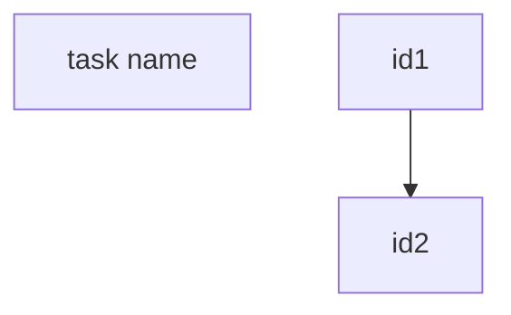

# Add Todo

Add new tasks to task tracking file with YAML/JSON structure and optional mermaid flowchart.

## Workflow

1. **Read file**: Read current task tracking file to understand context
2. **Understand task**: Clarify new task's purpose and scope
3. **Identify dependencies**: Check if task depends on or blocks existing tasks (ask if unclear)
4. **Update data**: Add task to YAML/JSON section using Edit tool
5. **Update flowchart(optional)**: If mermaid exists, run generate_mermaid.py and update
6. **Confirm**: Verify update with user

## File Format

Task tracking files use this structure:

```yaml
nodes:
    - "task name":
        state:        # required: task status
        create_time:  # required: creation timestamp
        finish_time:  # optional
        ...           # other infos
relations:
    - ["prerequisite task", "dependent task"]
```

Optional mermaid diagram:



## Script

### generate_mermaid.py

Generate mermaid from YAML/JSON string:

```bash
python scripts/generate_mermaid.py '<yaml_or_json_string>'
```

Example with YAML:
```bash
python scripts/generate_mermaid.py 'nodes:
    - "task A":
        state: done
    - "task B":
        state: pending
relations:
    - ["task A", "task B"]'
```

Example with JSON:
```bash
python scripts/generate_mermaid.py '{"nodes":[{"name":"task A"},{"name":"task B"}],"relations":[["task A","task B"]]}'
```

