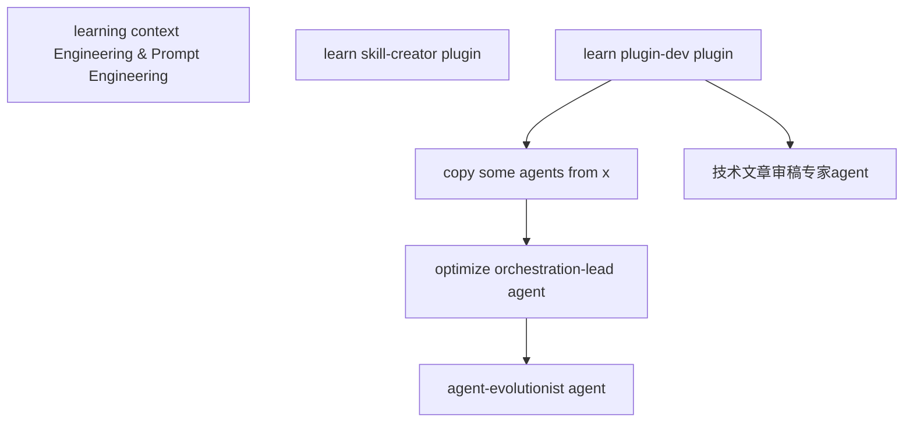

```yaml
nodes:
    - "copy some agents from x":
        state: pending
        create_time: 2026-02-25
        reference:
            link: https://github.com/anthropics/claude-code
            agents:
                - "plugins/pr-review-toolkit/agents/pr-test-analyzer.md"
                - "plugins/pr-review-toolkit/agents/code-simplifier.md"
                - "plugins/plugin-dev/agents/skill-reviewer.md"
                - "plugins/plugin-dev/agents/agent-creator.md"
                - "plugins/feature-dev/agents/code-explorer.md"
                - "plugins/feature-dev/agents/code-architect.md"
                - "plugins/hookify/agents/conversation-analyzer.md (about evolution)"
    - "optimize orchestration-lead agent":
        state: pending
        create_time: 2026-02-25
    - "add a plan skill":
        state: done
        create_time: 2026-02-25
        remark: "claude offical done"
    - "optimize-skill skill":
        state: done
        create_time: 2026-02-25
        remark: "claude offical done"
    - "agent-evolutionist agent":
        state: pending
        create_time: 2026-02-25
    - "skill explore-github":
        state: done
        create_time: 2026-02-25
    - "技术方案调研专家agent":
        state: done
        create_time: 2026-02-25
    - "技术文章审稿专家agent":
        state: pending
        create_time: 2026-02-25
    - "learning context Engineering & Prompt Engineering":
        state: pending
        create_time: 2026-02-26
        reference: 
            links:
                - "https://platform.claude.com/docs/en/build-with-claude/context-windows"
                - "https://mp.weixin.qq.com/s/C5w6sD4VGJjZ_xrW7vvjRA"
    - "package-snapshot skill":
        state: done
        create_time: 2026-03-01
        description: "A skill to package all .claude config (skills and agents)"
        remark: "replace it with claude plugin"
    - "learn skill-creator plugin":
        state: pending
        create_time: 2026-03-11
        description: "Learn how to use the skill-creator plugin for skill development"
    - "费曼学习法 agent or skill":
        state: done
        create_time: 2026-03-12
        description: "Create a Feynman learning method agent/skill for teaching and learning concepts"
    - "skill context-manage":
        state: done
        create_time: 2026-04-03
        description: "Create a skill for context management"
    - "learn plugin-dev plugin":
        state: pending
        create_time: 2026-04-18

relations:
    - ["copy some agents from x", "optimize orchestration-lead agent"]
    - ["optimize orchestration-lead agent", "agent-evolutionist agent"]
    - ["learn plugin-dev plugin", "copy some agents from x"]
    - ["learn plugin-dev plugin", "技术文章审稿专家agent"]
```


```mermaid
flowchart TD
    20260225_0["copy some agents from x"]
    20260225_1["optimize orchestration-lead agent"]
    20260225_2["agent-evolutionist agent"]
    20260225_3["技术文章审稿专家agent"]
    20260226_4["learning context Engineering & Prompt Engineering"]
    20260311_5["learn skill-creator plugin"]
    20260418_6["learn plugin-dev plugin"]

    20260225_0 --> 20260225_1
    20260225_1 --> 20260225_2
    20260418_6 --> 20260225_0
    20260418_6 --> 20260225_3
```