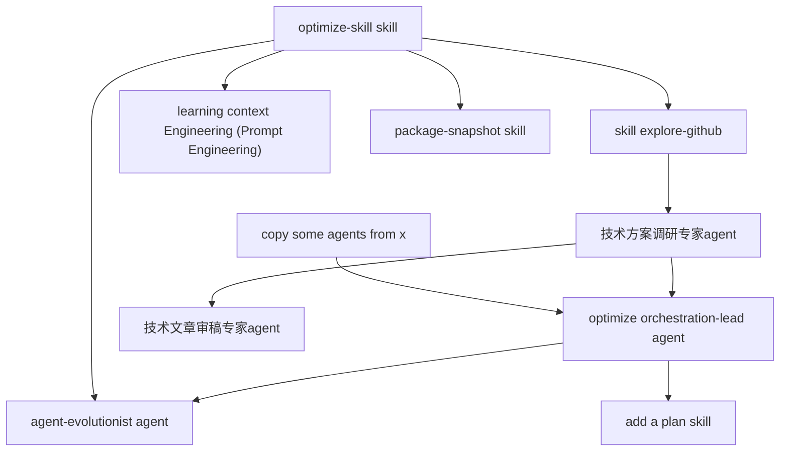

```yaml
nodes:
    - "copy some agents from x":
        state: pending
        create_time: 2026-02-25
        reference:
            link: https://github.com/anthropics/claude-code
            agents:
                - "plugins/pr-review-toolkit/agents/pr-test-analyzer.md"
                - "plugins/pr-review-toolkit/agents/code-simplifier.md"
                - "plugins/plugin-dev/agents/skill-reviewer.md"
                - "plugins/plugin-dev/agents/agent-creator.md"
                - "plugins/feature-dev/agents/code-explorer.md"
                - "plugins/feature-dev/agents/code-architect.md"
                - "plugins/hookify/agents/conversation-analyzer.md (about evolution)"
    - "optimize orchestration-lead agent":
        state: pending
        create_time: 2026-02-25
    - "add a plan skill":
        state: pending
        create_time: 2026-02-25
    - "optimize-skill skill":
        state: doing
        create_time: 2026-02-25
    - "agent-evolutionist agent":
        state: pending
        create_time: 2026-02-25
    - "skill explore-github":
        state: pending
        create_time: 2026-02-25
    - "技术方案调研专家agent":
        state: pending
        create_time: 2026-02-25
    - "技术文章审稿专家agent":
        state: pending
        create_time: 2026-02-25
    - "learning context Engineering (Prompt Engineering)":
        state: pending
        create_time: 2026-02-26
        reference: 
            links:
                - "https://platform.claude.com/docs/en/build-with-claude/context-windows"
                - "https://mp.weixin.qq.com/s/C5w6sD4VGJjZ_xrW7vvjRA"
    - "package-snapshot skill":
        state: pending
        create_time: 2026-03-01
        description: "A skill to package all .claude config (skills and agents)"
relations:
    - ["copy some agents from x", "optimize orchestration-lead agent"]
    - ["optimize orchestration-lead agent", "add a plan skill"]
    - ["optimize-skill skill", "agent-evolutionist agent"]
    - ["optimize orchestration-lead agent", "agent-evolutionist agent"]
    - ["optimize-skill skill", "skill explore-github"]
    - ["技术方案调研专家agent", "optimize orchestration-lead agent"]
    - ["skill explore-github", "技术方案调研专家agent"]
    - ["技术方案调研专家agent", "技术文章审稿专家agent"]
    - ["optimize-skill skill", "learning context Engineering (Prompt Engineering)"]
    - ["develop-skill skill", "package-snapshot skill"]
```

